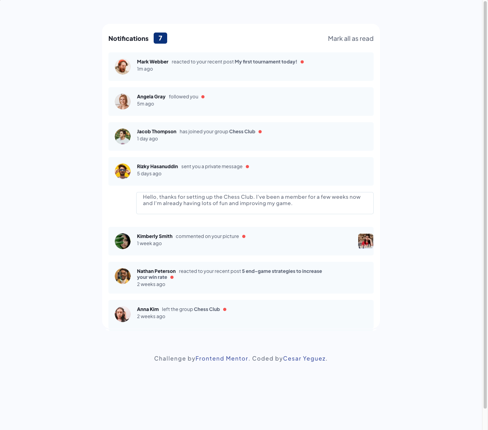
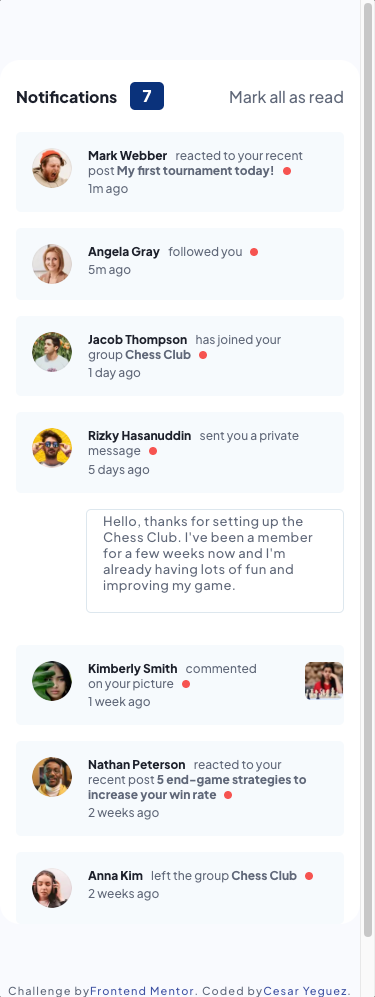

# Frontend Mentor - Notifications page solution

 Hello!! 🤟🤟, welcome to my repo, thanks for stopping by here.

This is a solution to the [Notifications page challenge on Frontend Mentor](https://www.frontendmentor.io/challenges/notifications-page-DqK5QAmKbC). Frontend Mentor challenges help you improve your coding skills by building realistic projects. 

## Table of contents

- [Overview](#overview)
  - [The challenge](#the-challenge)
  - [Screenshot](#screenshot)
  - [Links](#links)
- [My process](#my-process)
  - [Built with](#built-with)
  - [What I learned](#what-i-learned)
  - [Author](#author)


## Overview
The project consists of building a notification system, this must indicate how many comments are unread, and change status when clicking.

### The challenge

Users should be able to:

- Distinguish between "unread" and "read" notifications
- Select "Mark all as read" to toggle the visual state of the unread notifications and set the number of unread messages to zero
- View the optimal layout for the interface depending on their device's screen size
- See hover and focus states for all interactive elements on the page

### Screenshot





### Links
<a href="https://cyeguez.github.io/notifications-page-main/" target="_blank"></a>


		
## My process
-  I configure the project architecture . 🏛️
- I clean the HTML of Comments and styles. 🧹
- I assign the HTML tags. 🎯
- I write the styles, I configure mediaquerys. 🕶️
- I create the logical part in JS. 🧠


### Built with

 
  
  
  
  
  

		


### What I learned


I learned to assign styles to grandchildren when grandpa has a specific class

```
.publication.active .publication__content span {}
```


## Author

- Website - [César Yeguez](https://github.com/cyeguez) 👋
- Frontend Mentor - [@cyeguez](https://www.frontendmentor.io/profile/cyeguez)👇


